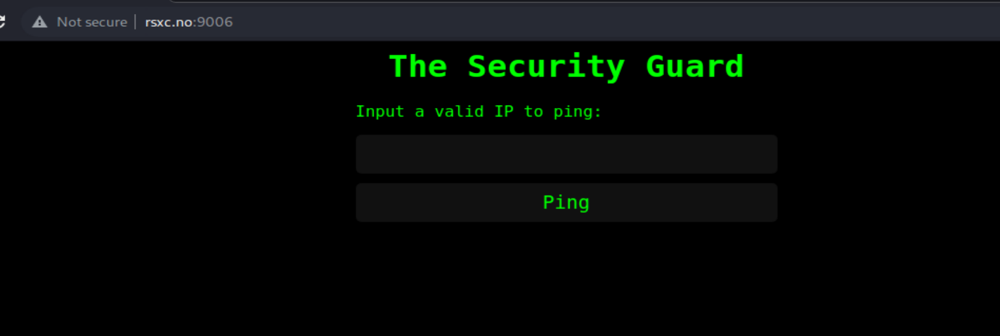
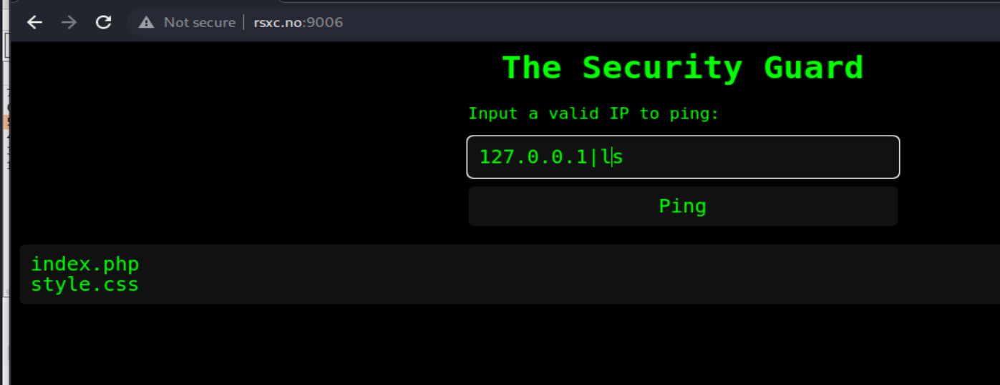
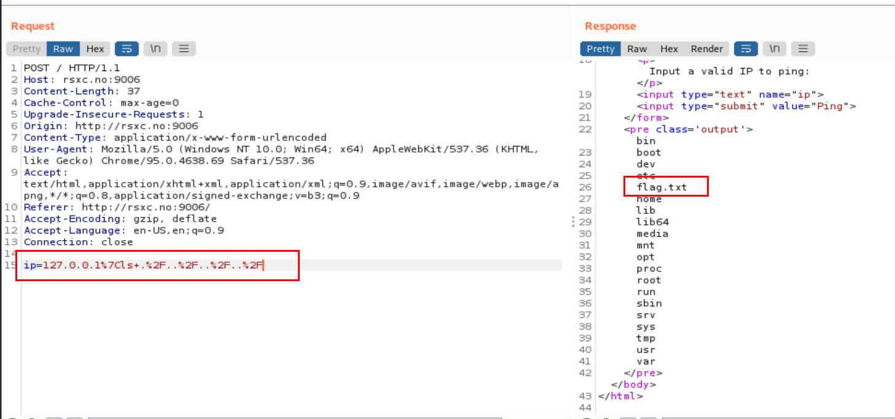
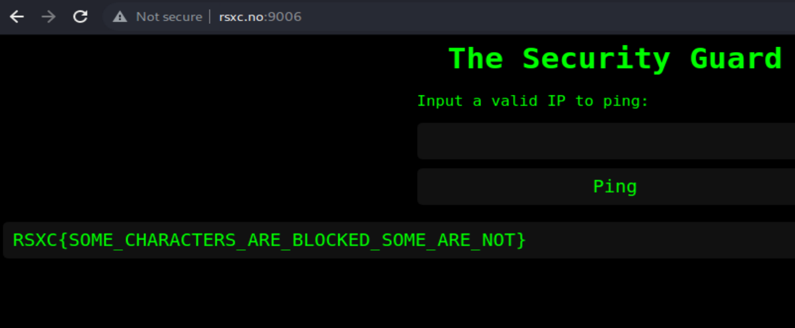

## The Security Guard

Task: Once in a remote Norwegian town, a group of skilled security professionals had convened in a fancy cabin to collaborate and achieve their objectives. On their network, they found a number of challenges that required their collective expertise. Do you have what it takes to tackle these challenges too?

The websites looks just like the first one:

I can also list files with `ip=127.0.0.1|ls`

This time the flag is not there.
So I have to navigate with several `../../` until I reach the flag.

The final payload is `127.0.0.1|cat ./../../../flag.txt`

