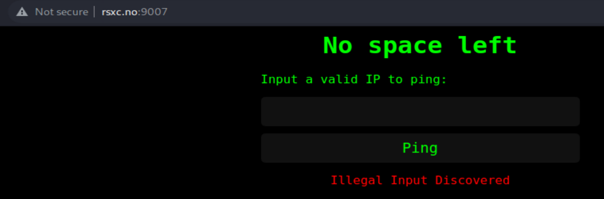
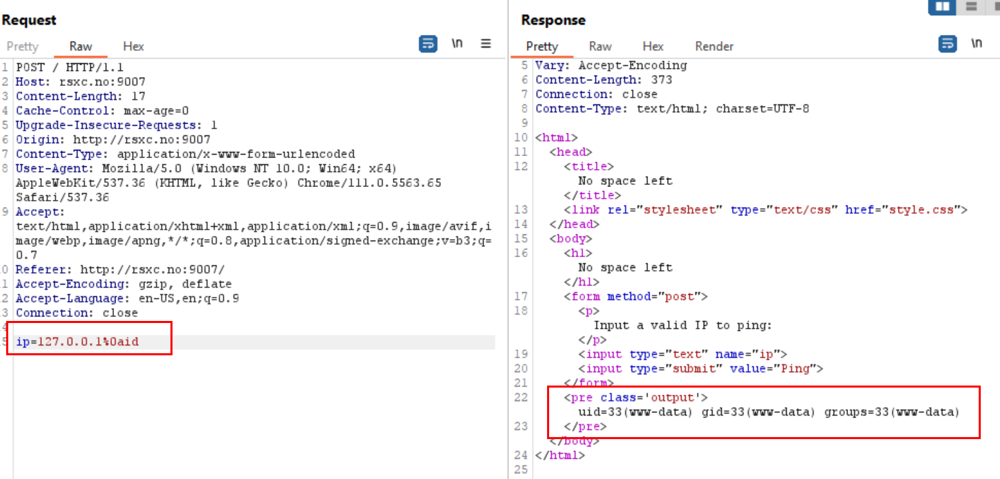
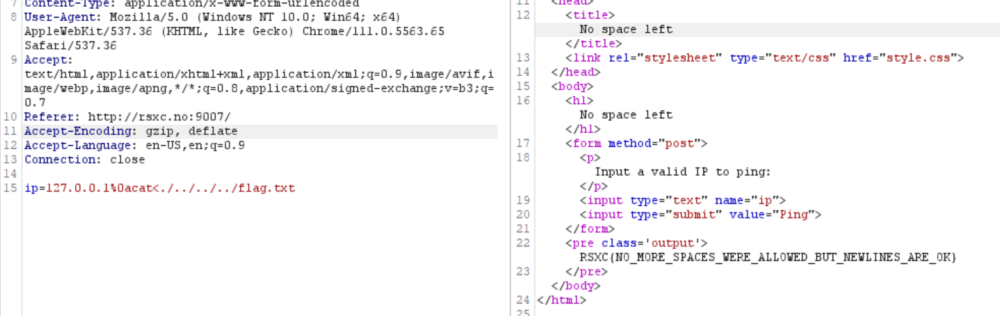

## No Space Left

Task: Once in a remote Norwegian town, a group of skilled security professionals had convened in a fancy cabin to collaborate and achieve their objectives. On their network, they found a number of challenges that required their collective expertise. Do you have what it takes to tackle these challenges too?

This time if I try `127.0.0.1|ls` I get an error:

I noticed many symbols where being blocked (and spaces as well) but `<` was not. I had to use Burp though, otherwise if I supplied my input through the UI, it tampered the request. 
%0a also works. 

In the end the payload was
`ip=127.0.0.1%0acat<./../../../flag.txt`

