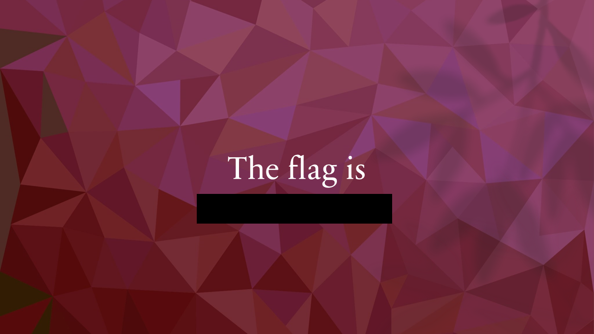
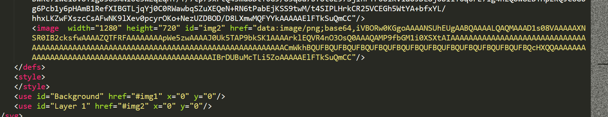
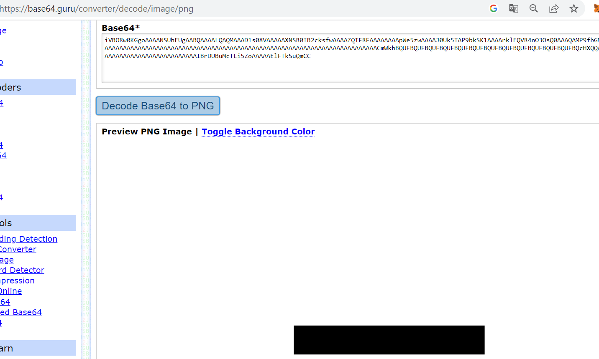
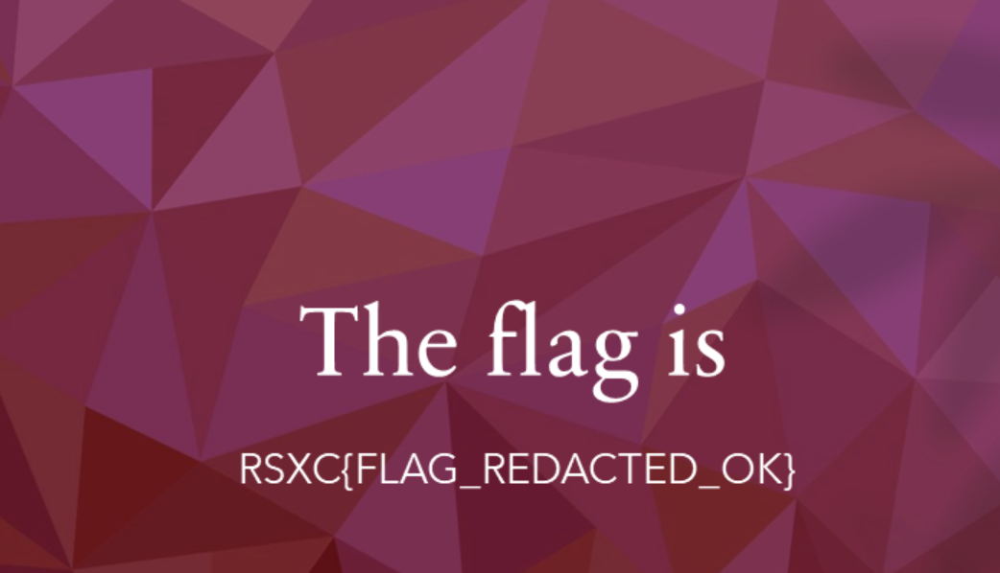

## The image

Task: We found this image on a website, and there seems to be something redacted. Could you help us figure out what they tried to hide?

The task provides you with a image.svg

I ran xxd on the file but in the end what worked better was simply to open the image with a text editor.
I notice there is a base64 encoded image there:

It represents the black stripe blocking the flag.
 
 
I can simply remove it and save the file to see the flag:
 