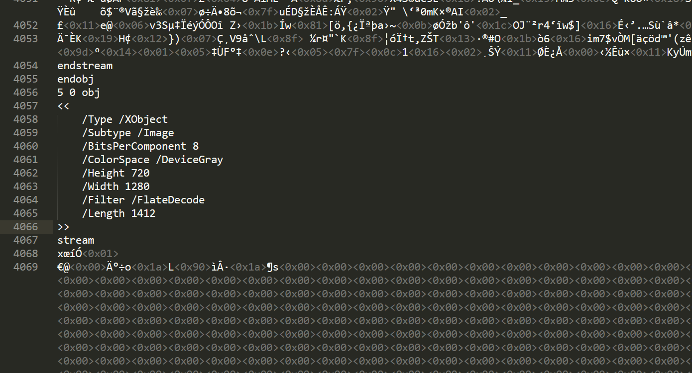
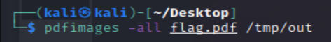
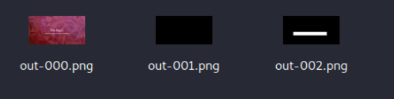

## The PDF

Task: We found this document on a website, and there seems to be something redacted. Could you help us figure out what they tried to hide?

The task provides you with a flag.pdf.

If I open the file with a text editor I see three subtype images:

I can run a tool like pdfimages and extract all images from the PDF.

I have three images like this:

One of them allows me to see the flag:

